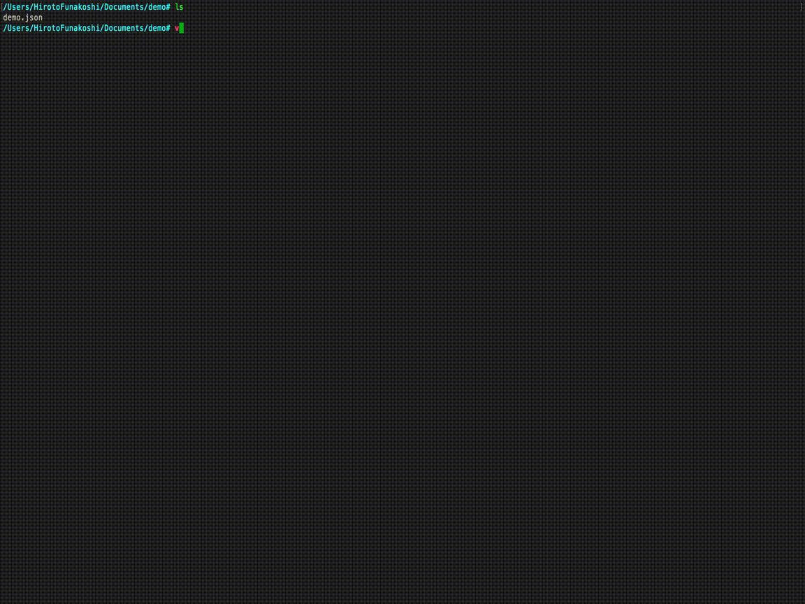

# gson.nvim  [](https://opensource.org/licenses/MIT) [](https://goreportcard.com/report/github.com/hlts2/gson.nvim) [](https://gitter.im/hlts2/gson.nvim?utm_source=badge&utm_medium=badge&utm_campaign=pr-badge&utm_content=badge)

gson.nvim is a Vim Plugin for JSON.

## Require

- NeoVim( >= 0.2.0)
- go (>= 1.8)

## Install

### 1. Install Neovim
See Neovim wiki.

- [Installing Neovim](https://github.com/neovim/neovim/wiki/Installing-Neovim)
- [Following HEAD](https://github.com/neovim/neovim/wiki/Following-HEAD)
- [Building](https://github.com/neovim/neovim/wiki/Building-Neovim)

### 2. Install go and set up
See go wiki

- [Install and Setup](https://github.com/golang/go/wiki#working-with-go)

### 3. Install Plugin
```vim
" dein.vim
call dein#add('hlts2/gson.nvim', {'build': 'make'})

" NeoBundle
NeoBundle 'hlts2/gson.nvim', {'build': {'unix': 'make'}}

" vim-plug
Plug 'hlts2/gson.nvim', { 'do': 'make'}
```

## Usage
### GosonFmt
- Format JSON

```vim
:GsonFmt
```

#### Demo


- Format JSON of selection

### Demo

